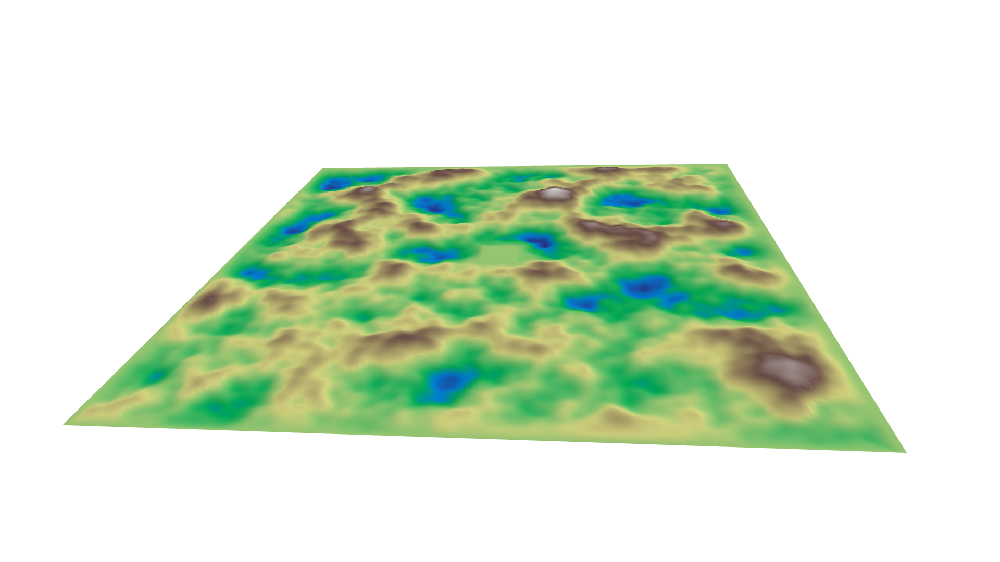
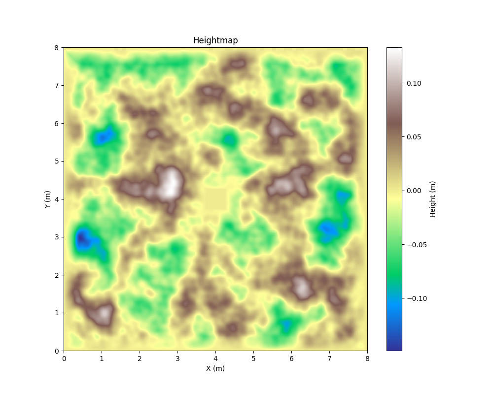
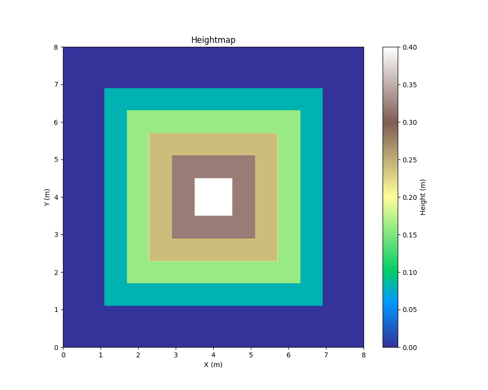
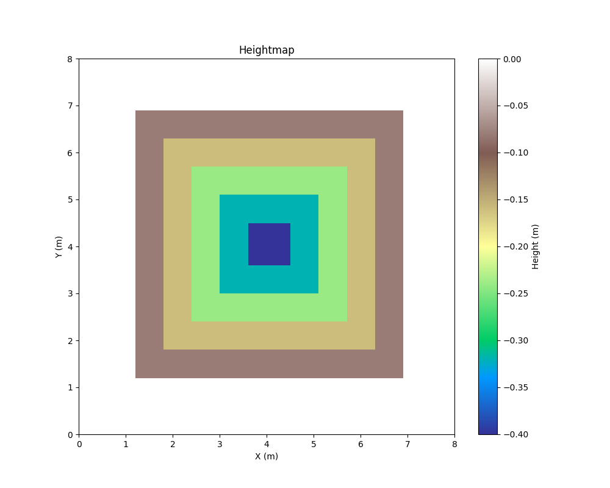
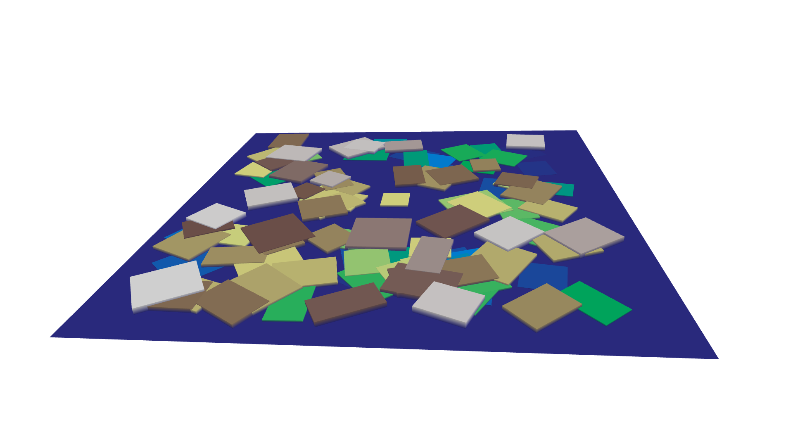
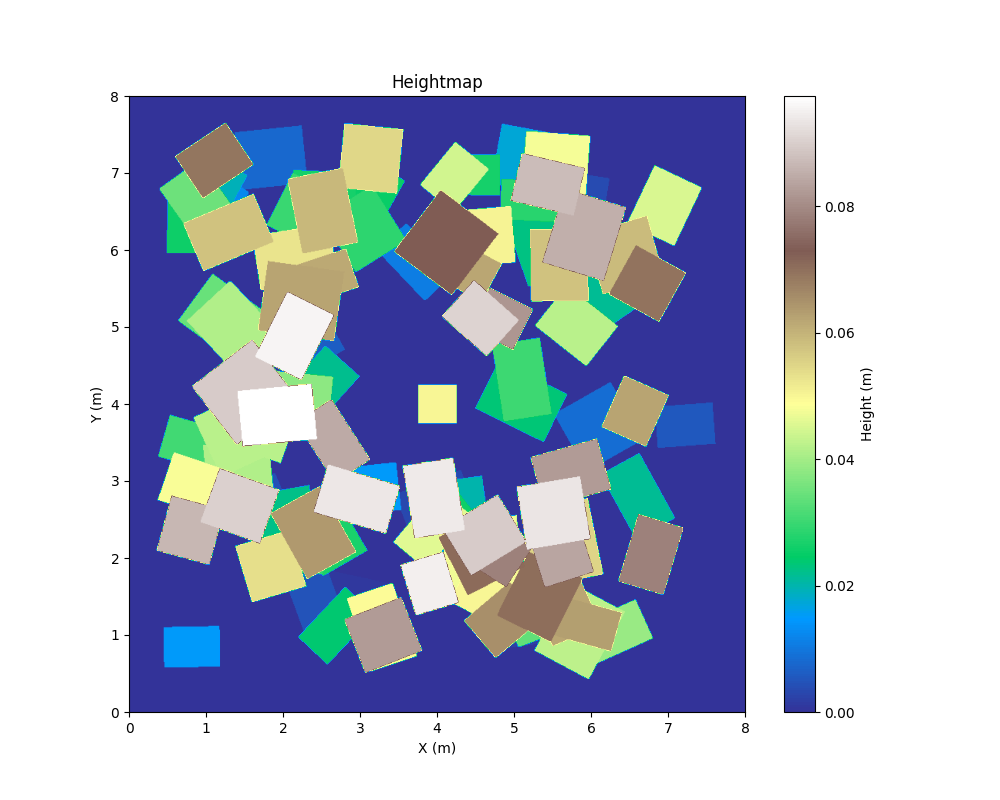

# issac-terrain-generator
Generating parametric terrains for robot policy learning using trimesh in python.

The terrains are constrains to be at altitude 0 near the edges, and have a center flat platform to start the robots on.

## examples

  
   

  
   

  
   

  
  

