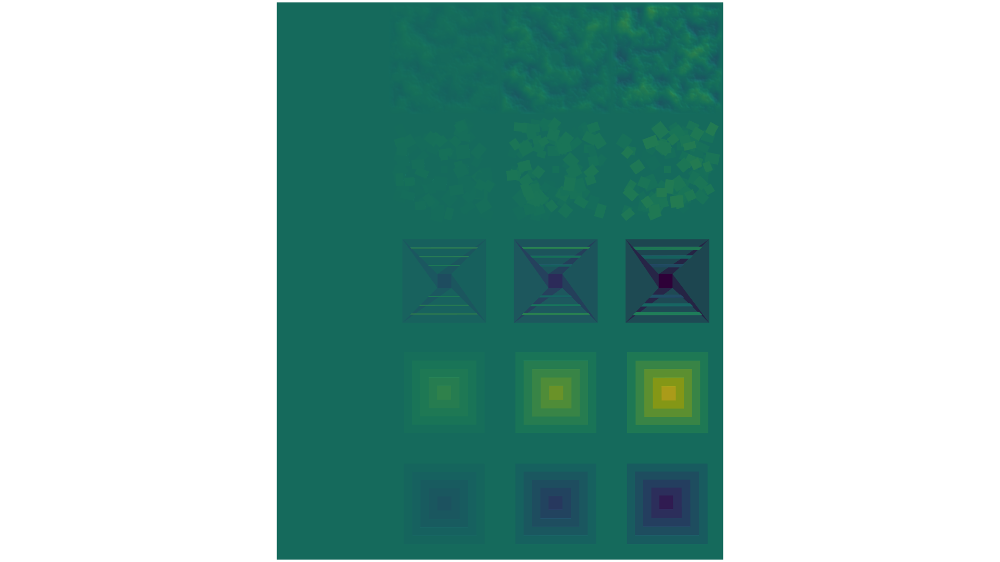
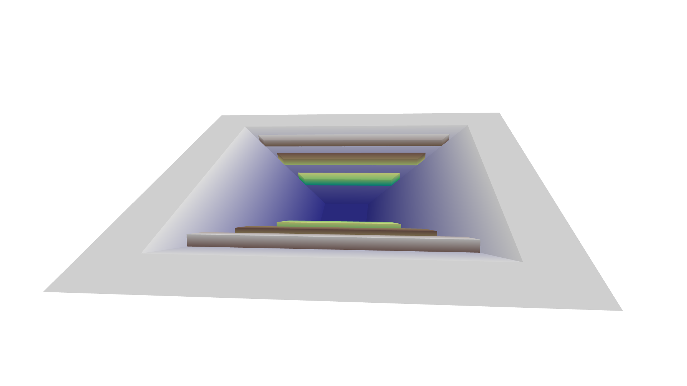
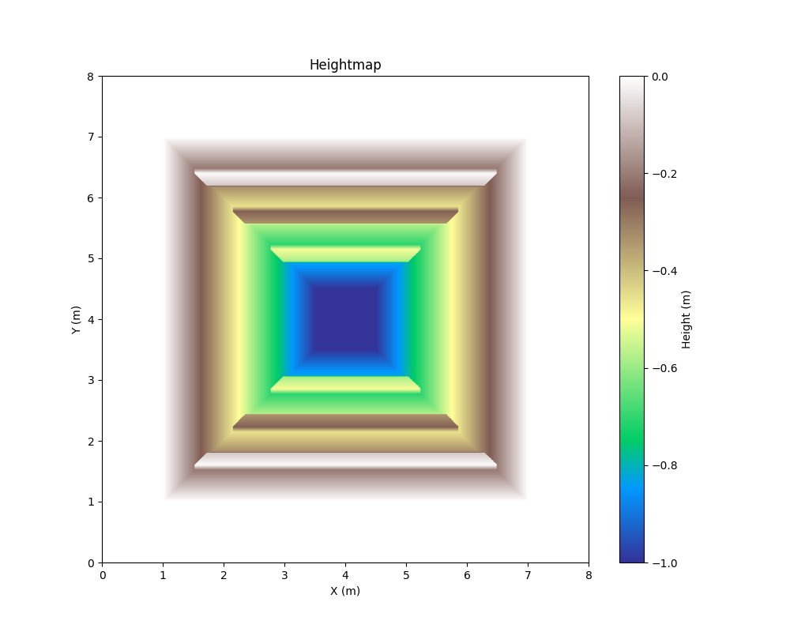
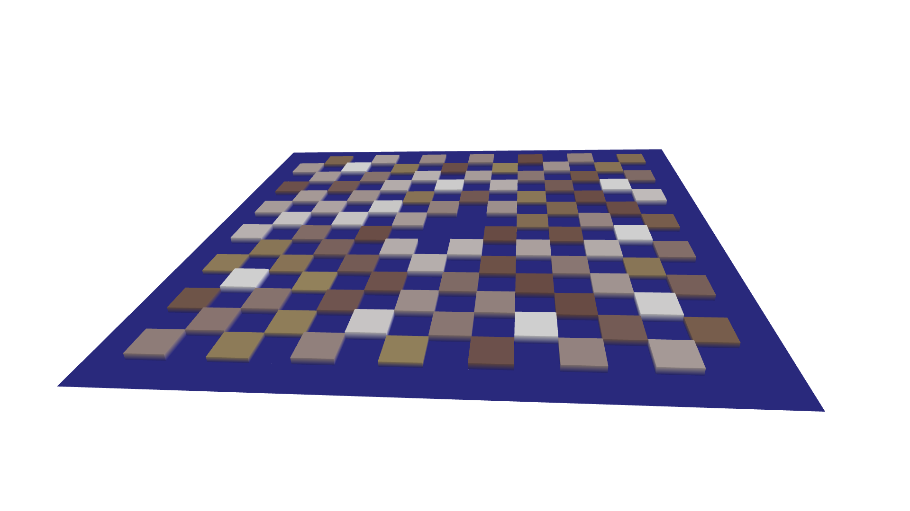
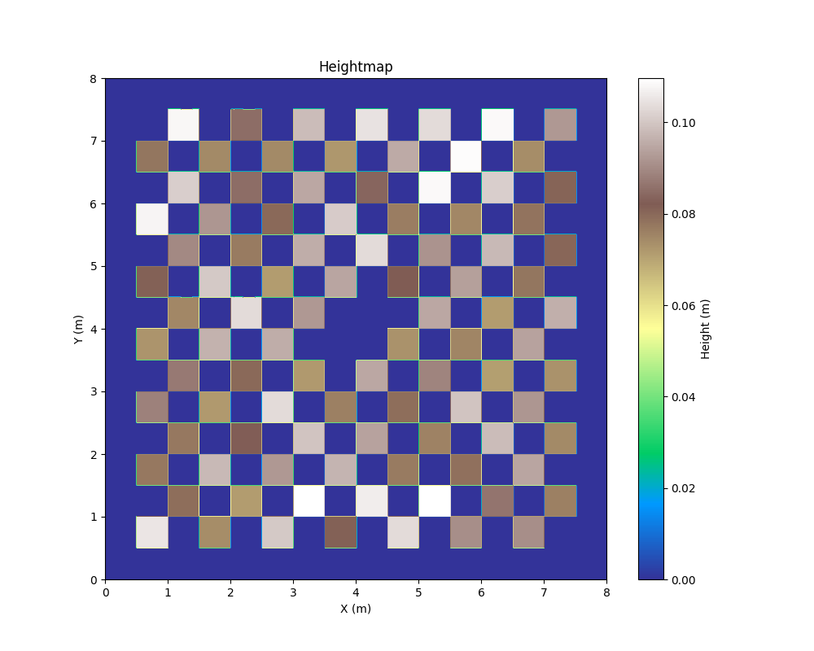
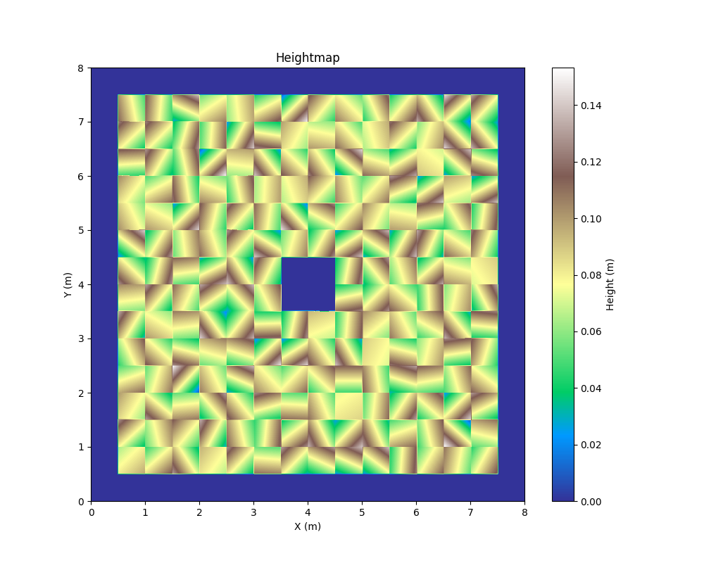
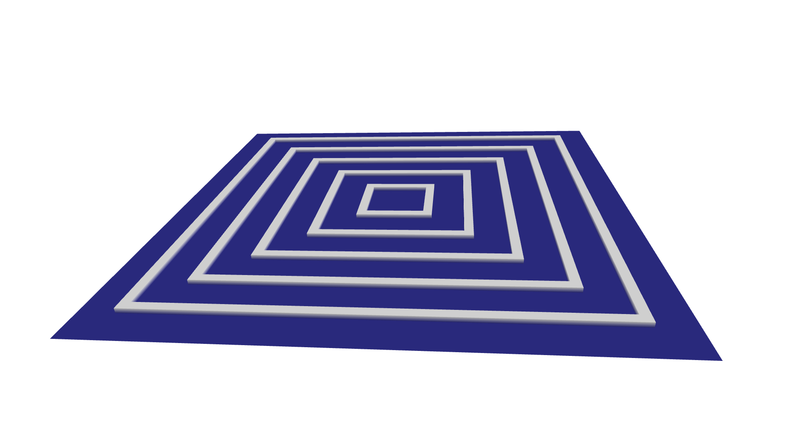
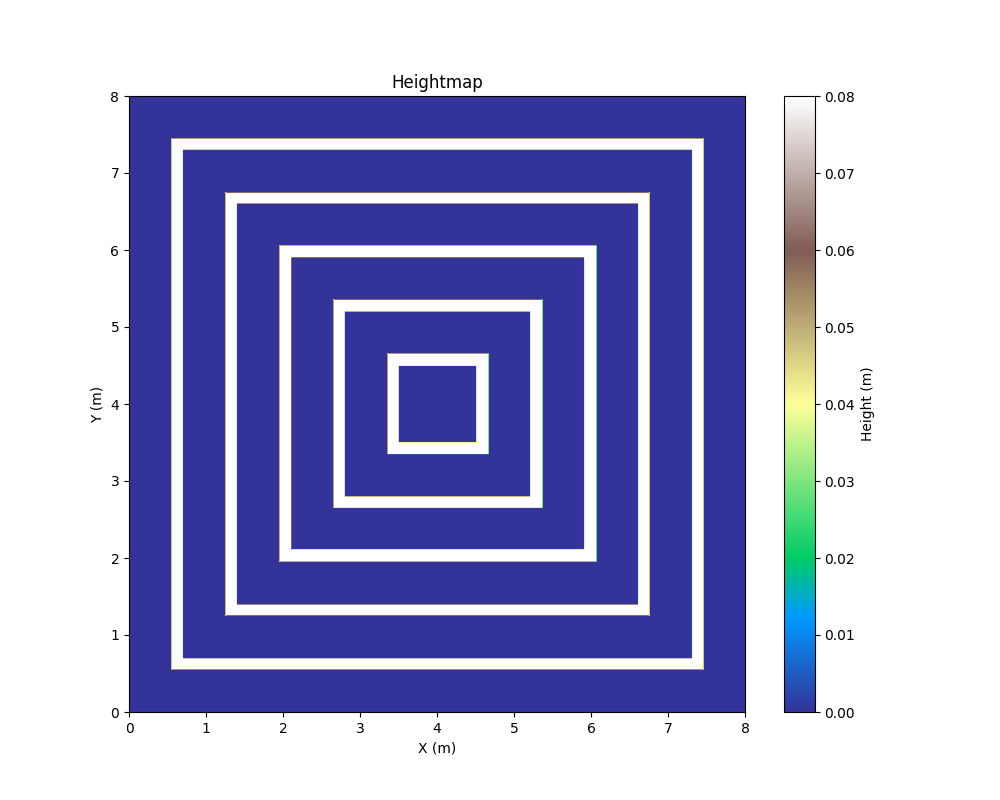

# Parametric Terrain Generator

Generating parametric terrains for robot policy learning using the Trimesh library in Python.

The terrains are constrained to be at altitude 0 near the edges, and have a center flat platform to start the robots on.

## Citing

If you use this parametric terrain generator in your research please use the following citation:

```bibtex
@misc{parametric2024,
title = {Parametric Terrain Generator},
author = {Leziart, Pierre-Alexandre and Flayols, Thomas},
month = {August},
year = {2024},
publisher = {GitHub},
journal = {GitHub repository},
howpublished = {\url{https://github.com/thomasfla/parametric-terrain-generator.git}},
}
```

## Example of generated terrain

<p float="middle">
  
</p>

## Examples of subterrains
<p float="middle">
  
   
</p>
<p float="middle">
  
   
</p>
<p float="middle">
  
   
</p>
<p float="middle">
  
  
</p>
<p float="middle">
  
  
</p>
<p float="middle">
  
  
</p>
<p float="middle">
  
  
</p>
<p float="middle">
  
  
</p>
